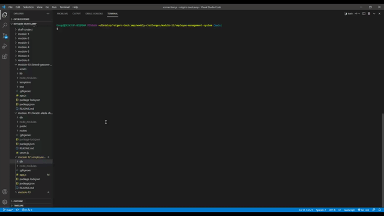

# SQL Employee Tracker

This is a command-line application to manage a company's employee database, using Node.js, Inquirer, and MySQL. 

## Installation

1. npm i - to install all file in order for npm to work
2. npm i inquirer - to use inquirer (to interact with the user via command line)
3. npm init - to create a json file
4. npm i mysql - to connect to MySql database
5. npm console.table - to format tables

## Usage

Start application by typing node app.js into the command-line/terminal. 

Follow along with prompts to select the option you wish to execute.

Once you have selected the prompt of your choosing, input your answer, and you will be directed back to the start menu.

## Screenshot and Video

## Technology Used

MySQL: Relational database management system based on SQL – Structured Query Language, used in this applicationt to warehouse and query employee and company data.
Express.js - Used for application set up of middle ware for end point connection between the front end and backend.
Node.js - Used for package managment and to execute JavaScript code to build command line tool for server-side scripting.
Javascript - Used to base functionality of functions and prompts within the application.

## Contributors

This project was also completed with the help of Reuben Genkin and Marykate Smith.
